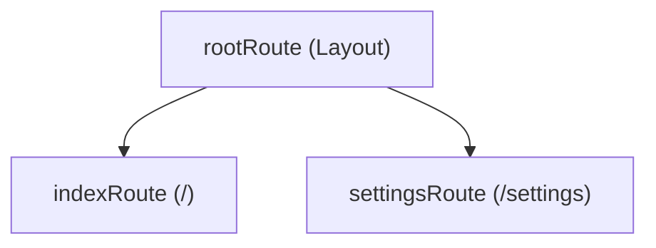

# Data Model: Frontend Routing (TanStack Router)

## Route Structure

The application will use a type-safe route tree.

## Route Definitions

| Route | Path | Component | Description |
|-------|------|-----------|-------------|
| `rootRoute` | N/A | `Layout.tsx` | Main application shell with Sidebar/Header |
| `indexRoute` | `/` | `Connections.tsx` | Home view with connection list/empty state |
| `settingsRoute` | `/settings` | `Settings.tsx` | Application settings page |

## Type Safety

### Navigation
Navigation is performed using the generated `Link` component or `useNavigate` hook, which are typed based on the route tree.

### Search Parameters
Search parameters will be defined using a schema (e.g., via `zod` or simple TS interfaces) to ensure they are parsed and typed correctly.

- **Example**: `?theme=dark` would be typed as `{ theme: 'light' | 'dark' }`.