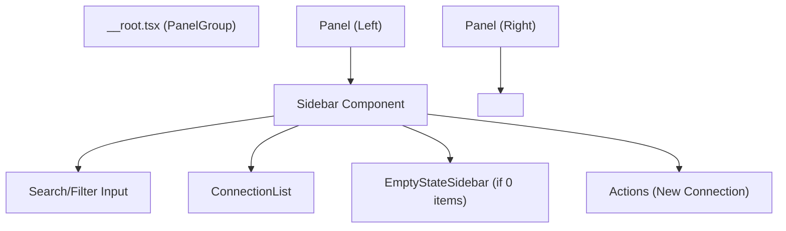

# Data Model: Global Sidebar

## UI State

The sidebar introduces transient UI state to manage its presentation.

| Property | Type | Description | Persistence |
|----------|------|-------------|-------------|
| `layout` | `number[]` | Array of panel sizes (percentages) | `localStorage` (key: `sidebar-layout`) |
| `isCollapsed` | `boolean` | Whether the sidebar is fully collapsed | Derived from `layout` |

## Entities

### Connection Profile (Read-Only)
The sidebar displays a list of these entities, fetched via the existing backend API.

| Field | Type | Description |
|-------|------|-------------|
| `id` | `string` | Unique identifier |
| `name` | `string` | Display name of the connection |
| `database_type` | `string` | Icon/Badge determinant (e.g., 'postgres', 'mysql') |

## Component Structure

